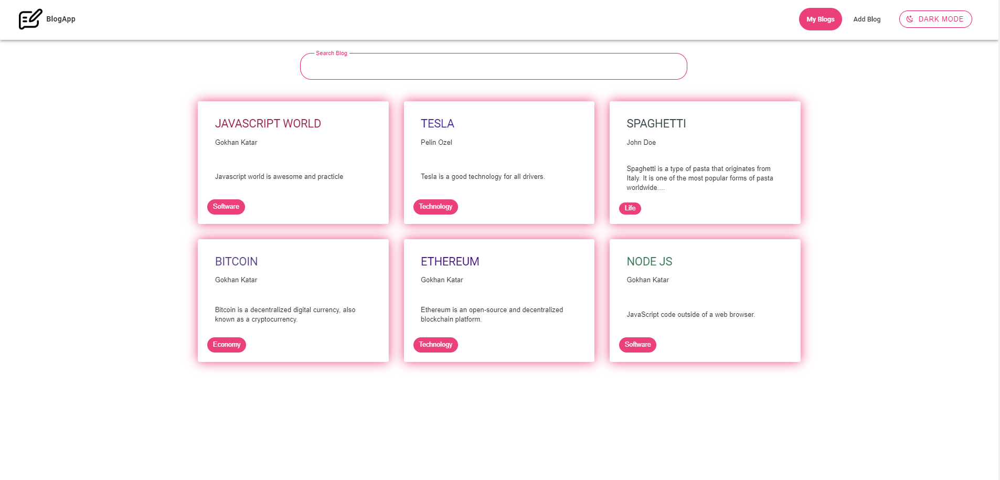
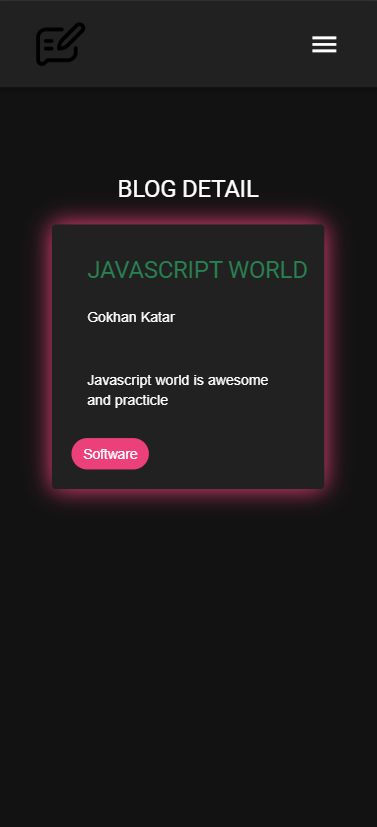

## Blog App


## Technologies

- Vue
- Vite
- Vuetify
- Vue Router
- Pinia
- Axios
- Firebase

## Dark Mode


## Tablet View


## Mobile View


## Detail View


## Installation

To clone the repository, run the following command:

```sh
git clone https://github.com/gokhankatar/blog-app

``` 
go to directory

```sh
cd .\blog-app\

``` 
and then install npm:

```sh
npm install -f

``` 
open your browser:

```sh
npm run dev
